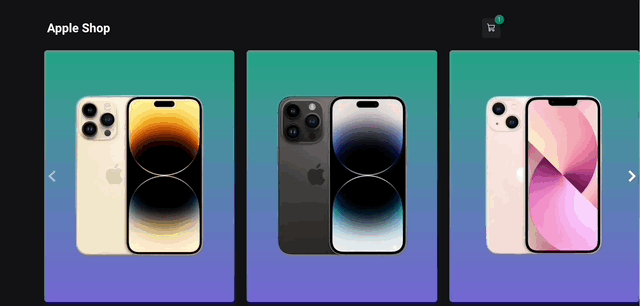
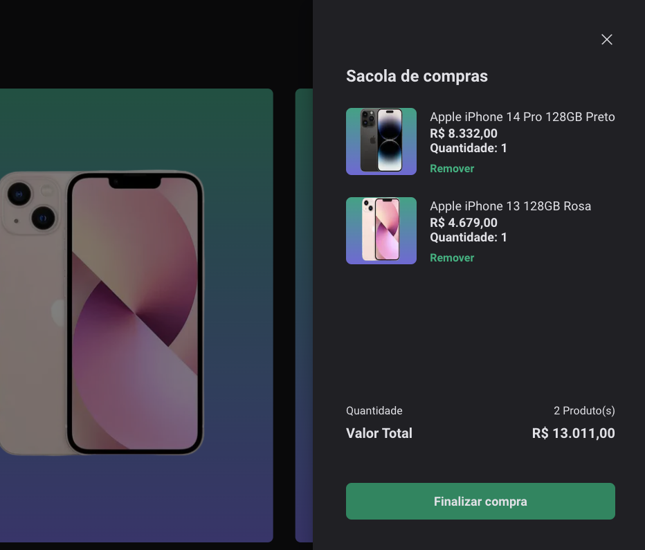
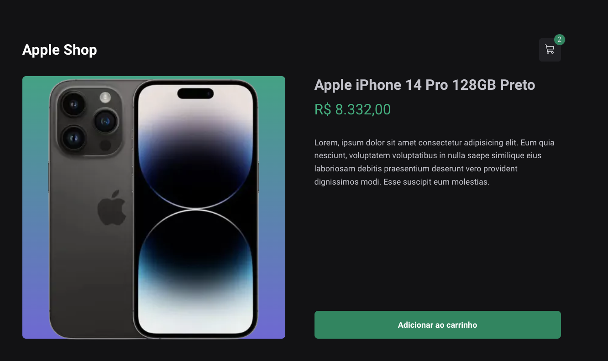
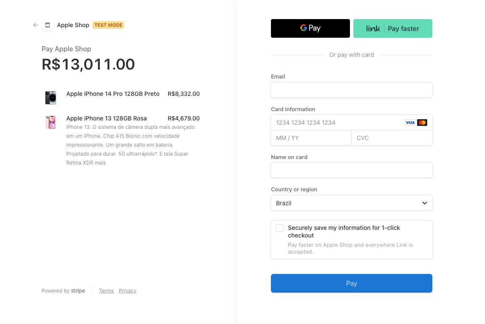
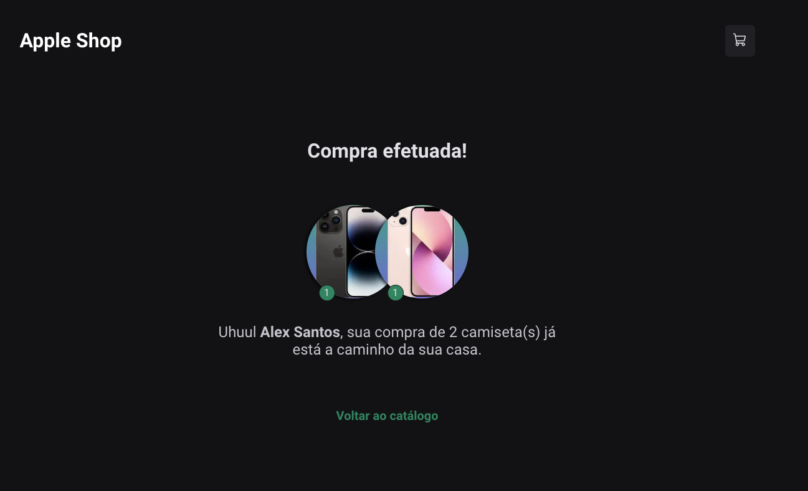

<h1 align="center">Apple Shop - Loja Fictícia de Produtos Apple</h1>

Criação de um e-commerce rápido de produtos Apple com carrinho de compras e integração com o Stripe para pagamentos.

  <h3> 🚀 Publicado 🚀 </h3>
  <strong><a href="https://apple-shop-alex-santos.vercel.app/" target="_blank">🔗 Visualize o projeto clicando aqui</a></strong>

# Sumário
-[Funcionalidades](#funcionalidades)  
-[Imagens](#imagens) 
-[Tecnologias](#tecnologias) 

# Funcionalidades
- [x] Vitrine de Produtos, consumindo Stripe API
- [x] Slide Carrossel na Vitrine de Produtos
- [x] Adição de Produto ao carrinho direto da Vitrine
- [x] Contagem de Produtos no Carrinho
- [x] Modal Lateral com Visualização de detalhes do carrinho e edição do mesmo
- [X] Cálculo de Valor Total do Pedido
- [X] Finalização de compra pelo Stripe
- [x] Redirecionamento para a página de Compra Realizada com informações do Pedido - (utilize um cartão de testes do Stripe para verificar)
- [ ] Responsividade para o mobile

# Imagens

# Tecnologias
As ferramentas utilizadas foram:
<ul style="list-style: none">
  <li>React com o Next.js</li>
  <li>Typescript</li>
  <li>Stripe</li>
  <li>Axios</li>
  <li>Material Ui</li>
  <li>Stitches Styling</li>
  <li>Keen Slider</li>
  <li>Phosphor Icons</li>
  <li>React Router</li>
</ul>

  <h3> 🚀 Publicado 🚀 </h3>
  <strong><a href="https://apple-shop-alex-santos.vercel.app/" target="_blank">🔗 Visualize o projeto clicando aqui</a></strong>

# Autor

<a href="https://github.com/devalexsantos">Alex Santos</a>

